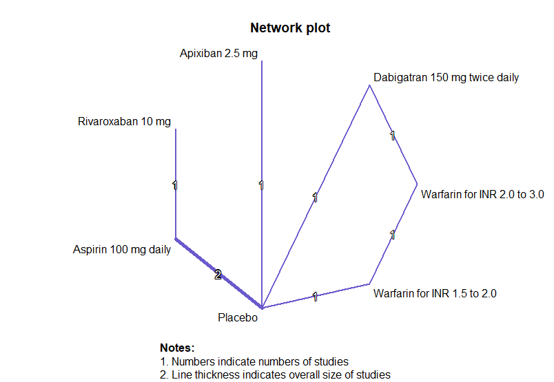
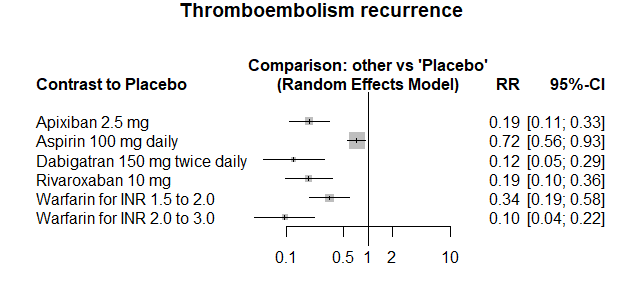

Venous thromboembolism secondary prevention
============================================
A living systematic review: **under construction** *lit search and writing have not been completed. Part of writing below are from a template and irrelevant to this topic.*

Short url: https://openMetaAnalysis.github.io/Venous-thromboembolism-secondary-prevention

**Clinical summary:** This network meta-analysis of multiple treatment comparisons suggests that the most effective treatment is *x*. Heterogeneity of results as measured by I2 was '[moderate](http://handbook-5-1.cochrane.org/chapter_9/9_5_2_identifying_and_measuring_heterogeneity.htm)' at XX%. This review updates the previously published meta-analysis.(1)

Meta-regression dooes not find modulators (year of publication, study size, event rate in the control groups) on the effect of the intervention.
* [Reconciliation of conclusions with prior meta-analyses](files/reconciliation-tables/Reconciliation%20of%20conclusions.pdf) (under construction)
* [Keep current with this topic](files/searching/Keep-up.md) (under construction)

Acknowledgement: we acknowledge the essential work by the authors of the prior systematic review(s) listed below.

**Methods overview:** This repository is an [openMetaAnalysis](https://openmetaanalysis.github.io/) that combines methods of scoping, rapid, and living systematic reviews.  This analysis updates one or more previously published review(s) below. A comparison of studies included in this review compared to prior reviews are in the table, [reconciliation of trials included with prior meta-analyses/](files/reconciliation-tables/Reconciliation%20of%20studies.pdf). Newer studies included are listed in the references below. Rationale for newer trials excluded may be listed at the end of the references. 
* [Methods](http://openmetaanalysis.github.io/methods.html) for openMetaAnalysis
* [Evidence search](files/searching/evidence-search.md) for this review (under construction)

**Results:** Details of the studies included are in the:
* [Reconciliation of trials included with prior meta-analyses/](files/reconciliation-tables/Reconciliation%20of%20studies.pdf) (under construction)
* [Description of studies (PICO table)](files/study-details/table-pico.pdf) (under construction)
* [Risk of bias assessment](files/study-details/table-bias.pdf) (under construction)
* [Forest plots](../master/files/forest-plots) ([source data](files/data))
* [Network plots](../master/files/network) (optional)
* [Reconciliation of conclusions with prior meta-analyses](files/reconciliation-tables/Reconciliation%20of%20conclusions.pdf)

The network map for the primary outcomes are below. Additional [network maps](files/network) of secondary analyses may be available. 

The forest plot for the primary outcomes are below. Additional [forest plots](files/forest-plots) of secondary analyses may be available. 

References:
----------------------------------

### Systematic review(s)
#### Most recent review at time of last revision of this repository
1. Vasanthamohan L, Boonyawat K, Chai-Adisaksopha C, Crowther M. Reduced-dose direct oral anticoagulants in the extended treatment of venous thromboembolism: a systematic review and meta-analysis. J Thromb Haemost. 2018 Jul;16(7):1288-1295.  doi: 10.1111/jth.14156. PMID: [29772108](http://pubmed.gov/29772108).
2. Robertson L, Yeoh SE, Ramli A. Secondary prevention of recurrent venous thromboembolism after initial oral anticoagulation therapy in patients with unprovoked venous thromboembolism. Cochrane Database Syst Rev. 2017 Dec 15;12:CD011088. doi: 10.1002/14651858.CD011088.pub2. PMID: [29244199](http://pubmed.gov/29244199)

### Randomized controlled trials
#### New trial(s) *not* included in the most recent review above
None

#### Trial(s) included in the review above
1. Weitz JI, Lensing AWA, Prins MH, Bauersachs R, Beyer-Westendorf J, Bounameaux H, Brighton TA, Cohen AT, Davidson BL, Decousus H, Freitas MCS, Holberg G, Kakkar AK, Haskell L, van Bellen B, Pap AF, Berkowitz SD, Verhamme P, Wells PS, Prandoni P; EINSTEIN CHOICE Investigators. Rivaroxaban or Aspirin for Extended Treatment of Venous Thromboembolism. N Engl J Med. 2017 Mar 30;376(13):1211-1222. doi: 10.1056/NEJMoa1700518. PMID: [28316279](http://pubmed.gov/28316279).
2. Schulman S, Kearon C, Kakkar AK, Schellong S, Eriksson H, Baanstra D, Kvamme AM, Friedman J, Mismetti P, Goldhaber SZ; RE-MEDY Trial Investigators; RE-SONATE Trial Investigators. Extended use of dabigatran, warfarin, or placebo in venous thromboembolism. N Engl J Med. 2013 Feb 21;368(8):709-18. doi: 10.1056/NEJMoa1113697.PMID: [23425163](http://pubmed.gov/23425163).
3. Agnelli G, Buller HR, Cohen A, Curto M, Gallus AS, Johnson M, Porcari A, Raskob GE, Weitz JI; AMPLIFY-EXT Investigators. Apixaban for extended treatment of venous thromboembolism. N Engl J Med. 2013 Feb 21;368(8):699-708. doi: 10.1056/NEJMoa1207541. PMID: [23216615](http://pubmed.gov/23216615).
4. Brighton TA, Eikelboom JW, Mann K, Mister R, Gallus A, Ockelford P, Gibbs H, Hague W, Xavier D, Diaz R, Kirby A, Simes J; ASPIRE Investigators. Low-dose aspirin for preventing recurrent venous thromboembolism. N Engl J Med. 2012 Nov 22;367(21):1979-87. doi: 10.1056/NEJMoa1210384. PMID: [23121403](http://pubmed.gov/23121403).
5. Becattini C, Agnelli G, Schenone A, Eichinger S, Bucherini E, Silingardi M, Bianchi M, Moia M, Ageno W, Vandelli MR, Grandone E, Prandoni P; WARFASA Investigators. Aspirin for preventing the recurrence of venous thromboembolism. N Engl J Med. 2012 May 24;366(21):1959-67. doi: 10.1056/NEJMoa1114238. PMID: [22621626](http://pubmed.gov/22621626).
6. Kearon C, Ginsberg JS, Kovacs MJ, Anderson DR, Wells P, Julian JA, MacKinnon B, Weitz JI, Crowther MA, Dolan S, Turpie AG, Geerts W, Solymoss S, van Nguyen P, Demers C, Kahn SR, Kassis J, Rodger M, Hambleton J, Gent M; Extended Low-Intensity Anticoagulation for Thrombo-Embolism Investigators. Comparison of low-intensity warfarin therapy with conventional-intensity warfarin therapy for long-term prevention of recurrent venous thromboembolism. N Engl J Med. 2003 Aug  14;349(7):631-9.  PMID: [12917299](http://pubmed.gov/12917299).
7. Ridker PM, Goldhaber SZ, Danielson E, Rosenberg Y, Eby CS, Deitcher SR, Cushman M, Moll S, Kessler CM, Elliott CG, Paulson R, Wong T, Bauer KA, Schwartz  BA, Miletich JP, Bounameaux H, Glynn RJ; PREVENT Investigators. Long-term, low-intensity warfarin therapy for the prevention of recurrent venous thromboembolism. N Engl J Med. 2003 Apr 10;348(15):1425-34. Epub 2003 Feb 24. PMID: [12601075](http://pubmed.gov/12601075).

#### Study(ies) undergoing review
1. Wang KL, van Es N, Cameron C, Castellucci LA, Büller HR, Carrier M. Extended treatment of venous thromboembolism: a systematic review and network meta-analysis. Heart. 2018 doi:10.1136/heartjnl-2018-313617. MID: [3032739](http://pubmed.gov/3032739)

#### Trial(s) excluded - selected list of important trial(s)

#### Cited by
This repository is cited by:

1. WikiDoc contributors. Pending content page. WikiDoc. Nov 9, 2014. Available at: http://www.wikidoc.org/index.php/This_topic. Accessed November 9, 2014. 

-------------------------------
[Cite and use this content](https://github.com/openMetaAnalysis/openMetaAnalysis.github.io/blob/master/reusing.MD)  - [Edit this page](../../edit/master/README.md) - [License](files/LICENSE.md) - [History](../../commits/master/README.md)  - 
[Issues and comments](../../issues?q=is%3Aboth+is%3Aissue)

